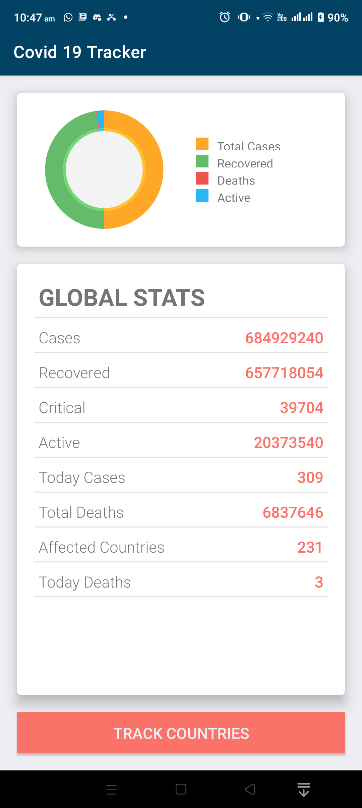
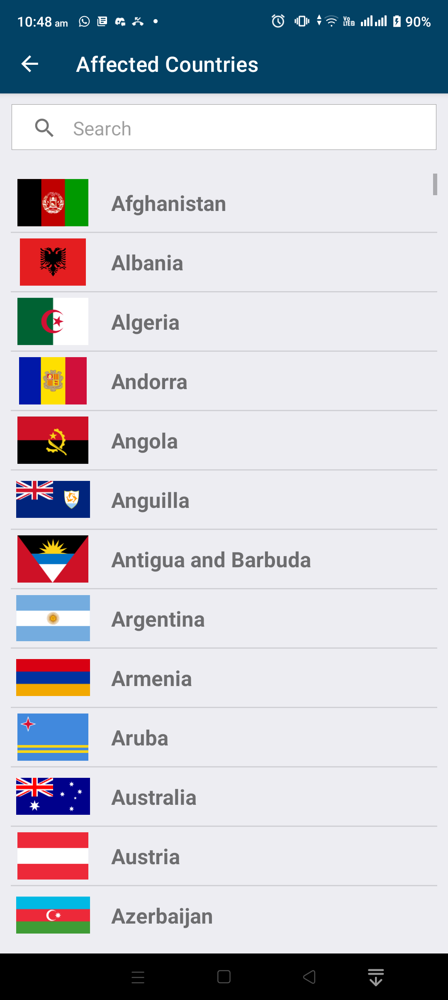
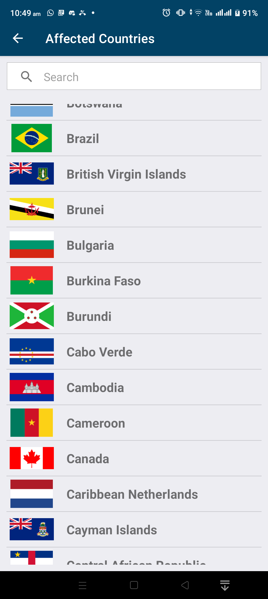
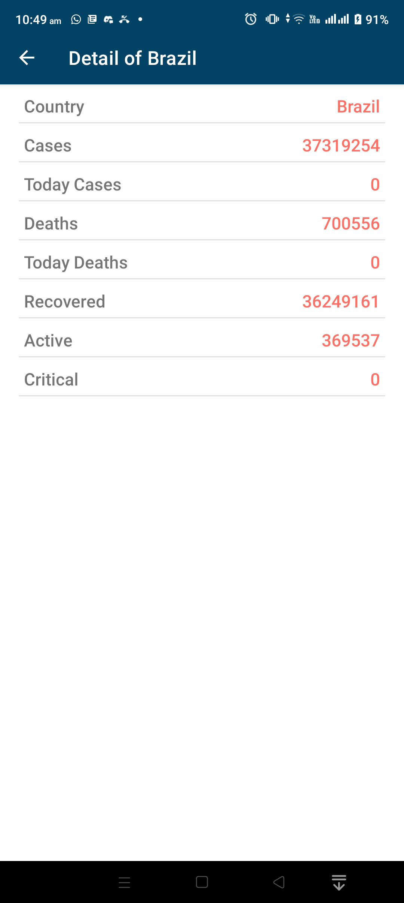
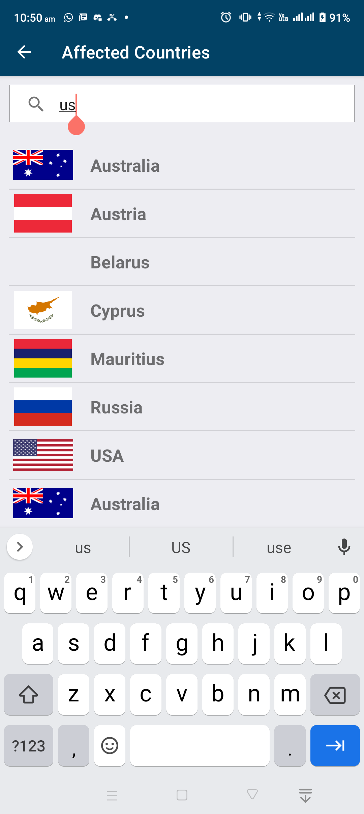

# Covid-19-Tracker
COVID-19 Tracker App helps users monitor the spread of the virus and stay informed about the latest updates and statistics.

This Project learning or Testing Covid 19 Tracker App anyOne Used this Project API or Library

 
 
 
  
   

